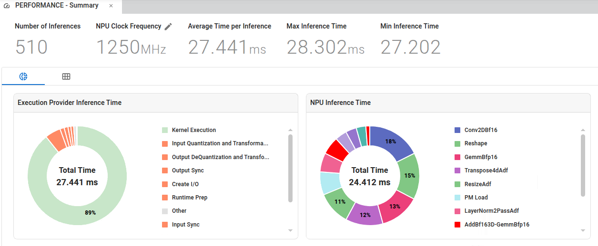
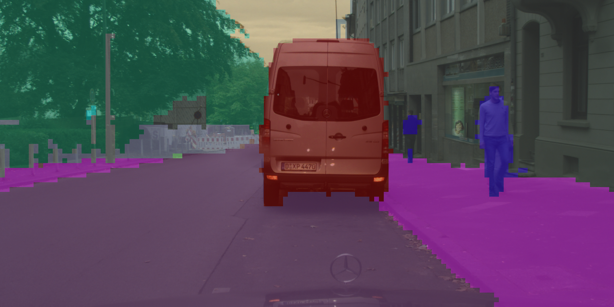

<table class="sphinxhide" style="width:100%;">
  <tr>
    <td align="center">
      <picture>
        <source media="(prefers-color-scheme: dark)" srcset="https://raw.githubusercontent.com/Xilinx/Image-Collateral/main/logo-white-text.png">
        
      </picture>
      <h1>Vitis AI Tutorials</h1>
    </td>
  </tr>
</table>

# SegFormer-B0 Semantic Segmentation

Semantic segmentation assigns a semantic label to every pixel in an image, enabling fine-grained scene understanding for applications such as autonomous driving, robotics, and intelligent surveillance.

SegFormer-B0 is a lightweight Transformer-based semantic segmentation model that combines a hierarchical Mix-Transformer (MiT) backbone with a simple and efficient MLP decoder. It delivers accurate pixel-level predictions while maintaining low computational complexity. With strong performance on high-resolution benchmarks such as Cityscapes and ADE20K, SegFormer-B0 is well suited for real-time and edge deployment on CPUs, GPUs, and NPUs.

A live segmentation example on the Cityscapes dataset using SegFormer-B0 is shown below:


This tutorial demonstrates how to deploy the SegFormer-B0 model using Vitis AI on the Versal Edge v2 platform. The workflow includes:

* Exporting the SegFormer-B0 model to ONNX format

* Compiling the ONNX model with Vitis AI for NPU execution

* Evaluating model accuracy and performance on CPU and NPU using the Cityscapes dataset

* Visualizing semantic segmentation results on sample images

* Creating a live demo for segmentation

## Exporting the SegFormer-B0 Model to ONNX

1. Set up the Conda environment

Create and activate a Python environment, then install the required dependencies:

```
conda create -n segformer python=3.12.1 -y
conda activate segformer
pip install transformers onnx onnxruntime optimum opencv-python onnxscript
```

2. Export the ONNX model

Clone the project repository and run the export script:

```
python3 export_onnx.py
```

After execution, the ONNX model file will be generated:

```
segformer_b0_cityscapes_256x512.onnx
```

This model can be used for further compilation, evaluation, and deployment with Vitis AI.

## Compiling the ONNX Model with Vitis AI

1. Grant write permission

Grant write access to the Vitis AI compilation directory:

```
chmod a+w Vitis_AI_Segmentation
```

2. Compile the FP32 ONNX model

Inside the Vitis AI release Docker environment:

```
cd Vitis_AI_Segmentation
python3 compile.py
```

Example compilation output:

```
INFO: [VAIP-VAIML-PASS] No. of Operators : 
INFO:  VAIML     420
INFO: [VAIP-VAIML-PASS] No. of Subgraphs : 
INFO:    NPU     1
```

This indicates that the model has been successfully partitioned and one subgraph is mapped to the NPU.

3. Convert FP32 to FP16

If reduced memory usage or improved performance is required, convert the ONNX model to FP16. Inside the Vitis AI release docker:

```
python3 -m quark.onnx.tools.convert_fp32_to_fp16 \
    --input segformer_b0_cityscapes_256x512.onnx \
    --output segformer_b0_cityscapes_256x512_fp16.onnx 
```

4. Compile the FP16 model

```
python3 compile_fp16.py
```

Example compilation output:

```
INFO: [VAIP-VAIML-PASS] No. of Operators : 
INFO:  VAIML     378
INFO: [VAIP-VAIML-PASS] No. of Subgraphs : 
INFO:    NPU     1
```

## Evaluating the ONNX model on CPU and NPU using the Cityscapes dataset

1. Prepare Cityscapes Dataset

Download Cityscapes datasets from https://www.cityscapes-dataset.com/downloads/. The following packages are required for this tutorial:

* gtFine_trainvaltest.zip

* leftImg8bit_trainvaltest.zip

After downloading and extracting, the directory structure should be:

```
cityscapes/
├── gtFine
│   ├── train
│   ├── val
│   └── test
├── leftImg8bit
│   ├── train
│   ├── val
│   └── test
├── gtFine_trainvaltest.zip
├── leftImg8bit_trainvaltest.zip
├── license.txt
└── README
```

2. Evaluate ONNX Model (CPU)

Run the following command to evaluate the SegFormer-B0 ONNX model on the Cityscapes validation set:

```
python3 eval_segformer_cityscapes_citywise.py \
    --onnx_model segformer_b0_cityscapes_256x512.onnx \
    --data_root ../datasets/cityscapes \
    --target cpu
```

This script will:

* Run inference on all 500 validation images

* Report per-city mIoU

* Report per-class IoU

* Compute overall mIoU

* Measure inference performance (FPS)

Example output:

```
Providers: ['CPUExecutionProvider']
Input shape: [1, 3, 256, 512]
Input type : tensor(float)
Output shape: [1, 19, 64, 128]
Layout: NCHW
Model size: 256 512
Model dtype: <class 'numpy.float32'>
================================
Total images: 500
Warmup...
100%|█████████████████████████████████████████| 500/500 [01:14<00:00,  6.68it/s]

===== Per-city mIoU =====
frankfurt      : 0.5119
munster        : 0.5355
lindau         : 0.5224

===== Overall =====
class  0: 0.9540
class  1: 0.6794
class  2: 0.8456
class  3: 0.4475
class  4: 0.3602
class  5: 0.3159
class  6: 0.3177
class  7: 0.4414
class  8: 0.8492
class  9: 0.5021
class 10: 0.8846
class 11: 0.5391
class 12: 0.2560
class 13: 0.8361
class 14: 0.4547
class 15: 0.5621
class 16: 0.3195
class 17: 0.3013
class 18: 0.4963
Overall mIoU: 0.5453957525983532
FPS (model only): 15.597483838901734
================================
```

Expected performance (CPU):

* Overall mIoU ≈ 0.52 - 0.56

* Inference speed ≈ 10 - 20 FPS (256x512 input)

Note: Performance may vary depending on CPU capability and workload characteristics.

Similarly, FP16 evaluation on CPU can be performed using the following command:

```
python3 eval_segformer_cityscapes_citywise.py \
    --onnx_model segformer_b0_cityscapes_256x512_fp16.onnx \
    --data_root ../datasets/cityscapes \
    --target cpu
```

3. Evaluate ONNX Model (NPU)

Evaluate BF16 implementation:

```
python3 eval_segformer_cityscapes_citywise.py \
    --onnx_model segformer_b0_cityscapes_256x512.onnx \
    --data_root ../datasets/cityscapes \
    --target npu \
    --cache_key segformer_b0_cityscapes_256x512
```

Evaluate FP16 model:

```
python3 eval_segformer_cityscapes_citywise.py \
    --onnx_model segformer_b0_cityscapes_256x512_fp16.onnx \
    --data_root ../datasets/cityscapes \
    --target npu \
    --cache_key segformer_b0_cityscapes_256x512_fp16
```

Accuracy comparison between CPU and NPU:

| Platform    | Overall Accuracy (mIoU) | Accuracy on city: Frankfurt | Accuracy on city: Munster | Accuracy on city: Lindau | Batch Size | End-to-End FPS |
|------------|-------------------------:|----------------------------:|--------------------------:|-------------------------:|------------|---------------:|
| CPU FP32   | 0.5453957525983532       | 0.5119                      | 0.5355                    | 0.5224                   | 1          | 15.59748383    |
| CPU FP16   | 0.5454004086621563       | 0.5119                      | 0.5355                    | 0.5225                   | 1          | 10.46182340    |
| NPU BF16   | 0.5448439856037361       | 0.5109                      | 0.5351                    | 0.5224                   | 1          | 36.44182063    |
| NPU FP16   | 0.545598734437236        | 0.5120                      | 0.5363                    | 0.5219                   | 1          | 29.56020714    |

AI Analyzer provides detailed timing breakdowns for NPU execution, including per-operator latency.
The figure below shows an example of BF16 results on the NPU.
As shown, the NPU inference time is approximately 24.412 ms, which represents the pure execution time on the NPU, excluding any host-side overhead. 



## Visualizing SegFormer-B0 Semantic Segmentation on Sample Images

1. Run inference on a single image using the CPU:

```
python demo_segformer_b0_onnx.py \
    --image_path ./pic/city.png \
    --onnx_model segformer_b0_cityscapes_256x512.onnx \
    --output_path demo/city.png \
    --target cpu
```

Input image: 


Segmentation result: 



The output image shows the semantic segmentation overlay generated by the SegFormer-B0 ONNX model.

2. Run inference on the NPU using the following commands:

BF16:

```
python demo_segformer_b0_onnx.py \
    --image_path ./pic/city.png \
    --onnx_model segformer_b0_cityscapes_256x512.onnx \
    --output_path demo/city_npu.png \
    --target npu \
    --cache_key segformer_b0_cityscapes_256x512 
```

FP16:

```
python demo_segformer_b0_onnx.py \
    --image_path ./pic/city.png \
    --onnx_model segformer_b0_cityscapes_256x512_fp16.onnx \
    --output_path demo/city_npu_fp16.png \
    --target npu \
    --cache_key segformer_b0_cityscapes_256x512_fp16
```

The output segmentation overlays are visually similar to the CPU result.

## Creating a Live Demo for Segmentation

The live demo is generated using consecutive frames from the ``leftImg8bit_demoVideo`` dataset. These sequential street-view images are processed frame by frame, and the resulting segmentation overlays are combined into a GIF using tools like ``ffmpeg``. Follow these steps to create the demo:

1. Download the dataset

Download ``leftImg8bit_demoVideo.zip`` from https://www.cityscapes-dataset.com/downloads/ and extract it.

2. Configure paths in ``gen_video_png.sh``

Update the script with your dataset and model paths:

```
INPUT_DIR="../datasets/cityscapes/leftImg8bit/demoVideo/stuttgart_00"
OUTPUT_DIR="demoVideo"
MODEL_PATH="segformer_b0_cityscapes_256x512.onnx"
TARGET="npu"
CACHE_KEY="segformer_b0_cityscapes_256x512"
```

2. Generate segmented images

Run the script to process all frames with the SegFormer-B0 model:

```
cd Vitis_AI_Segmentation
bash gen_video_png.sh 
```

3. Generate a GIF:

Combine the segmented frames into a GIF:

```
cd demoVideo
ffmpeg -framerate 10 -pattern_type glob -i 'stuttgart_00_00*_leftImg8bit.png' -vf "scale=600:-1" cityscapes.gif
```

Demo output using NPU

(note: give the page some minutes to load the gif, since gif is large)


## Conclusion

In this tutorial, we demonstrated how to deploy the SegFormer-B0 semantic segmentation model for real-time scene understanding on both CPU and NPU platforms. Key takeaways include:

* SegFormer-B0 is a lightweight Transformer-based model that balances high accuracy with low computational cost, making it suitable for edge deployment.

* We showed how to export the model to ONNX, compile it with Vitis AI, and perform inference on both CPU and NPU.

* The Cityscapes dataset was used to evaluate model performance, reporting both overall and per-city mIoU metrics.

* We also illustrated visualization techniques and created a live demo GIF from sequential street-view frames, showcasing real-time semantic segmentation results.

This workflow provides a complete pipeline for deploying SegFormer-B0 in practical applications such as autonomous driving, robotics, and intelligent surveillance, while leveraging hardware acceleration for faster inference.

<p class="sphinxhide" align="center"><sub>Copyright © 2024–2026 Advanced Micro Devices, Inc.</sub></p>

<p class="sphinxhide" align="center"><sup><a href="https://www.amd.com/en/corporate/copyright">Terms and Conditions</a></sup></p>

### License  
The MIT License (MIT)

Copyright © 2026 Advanced Micro Devices, Inc. All rights reserved.

Permission is hereby granted, free of charge, to any person obtaining a copy of this software and associated documentation files (the "Software"), to deal in the Software without restriction, including without limitation the rights to use, copy, modify, merge, publish, distribute, sublicense, and/or sell copies of the Software, and to permit persons to whom the Software is furnished to do so, subject to the following conditions:

The above copyright notice and this permission notice shall be included in all copies or substantial portions of the Software.

THE SOFTWARE IS PROVIDED "AS IS", WITHOUT WARRANTY OF ANY KIND, EXPRESS OR IMPLIED, INCLUDING BUT NOT LIMITED TO THE WARRANTIES OF MERCHANTABILITY, FITNESS FOR A PARTICULAR PURPOSE AND NONINFRINGEMENT. IN NO EVENT SHALL THE AUTHORS OR COPYRIGHT HOLDERS BE LIABLE FOR ANY CLAIM, DAMAGES OR OTHER LIABILITY, WHETHER IN AN ACTION OF CONTRACT, TORT OR OTHERWISE, ARISING FROM, OUT OF OR IN CONNECTION WITH THE SOFTWARE OR THE USE OR OTHER DEALINGS IN THE SOFTWARE.
